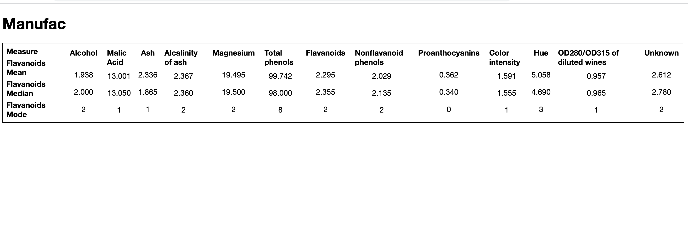

# test1

Project Name: test1

It would help if you had yarn installed on your machine before moving forward. To install Yarn visit - https://classic.yarnpkg.com/lang/en/docs/install/#mac-stable

Please install all the dependencies before running.
To install all the dependencies use - 

> yarn install

After that run the command 

> yarn start

Now visit **localhost:8080** in your browser and something like this will appear - 

